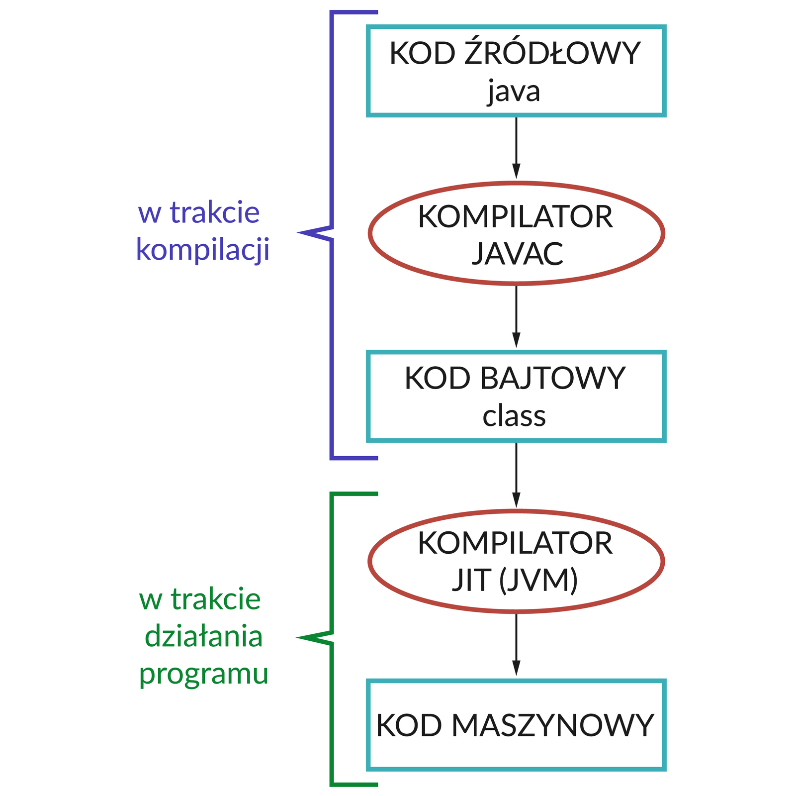
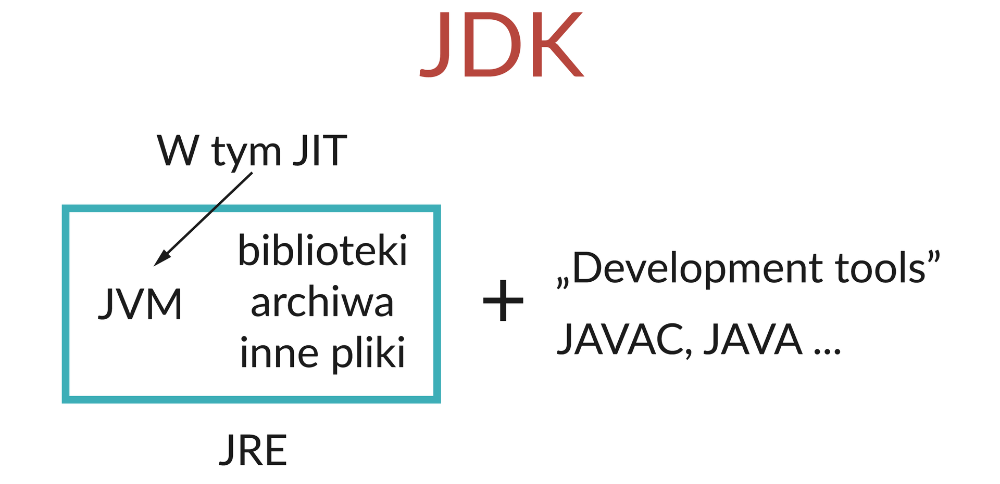
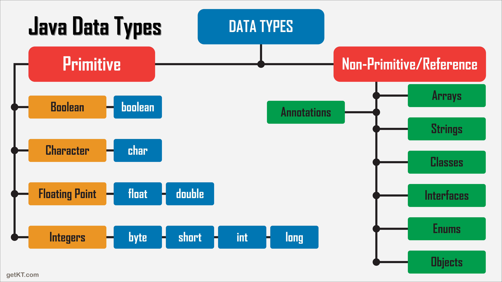

# Java - wstęp

* [Java - wstęp](#java---wstęp)
  * [Informacje o Javie](#informacje-o-javie)
  * [Typy danych](#typy-danych)
  * [Składnia](#składnia-języka-java)
    * [Program w języku Java](#program-w-języku-java)
    * [Zmienne](#zmienne)
    * [Wyświetlanie](#wyświetlanie-na-standardowym-wyjściu)
    * [Instrukcje warunkowe](#instrukcje-warunkowe)
    * [Tablice](#tablice)
    * [Pętle](#pętle)
    * [Metody i funkcje](#metody-i-funkcje)
  * [Zadania](#zadania)

---

## Informacje o Javie

Java jest językiem kompilowanym. Oznacza to, że kod źródłowy jest tłumaczony przez tzw. kompilator na inny rodzaj kodu.  



W Javie są dwa etapy kompilacji. Pierwszy etap to kompilacja kodu źródłowego na kod bajtowy za pomocą kompilatora `javac`.
Taki kod bajtowy jest następnie w trakcie działania programu kompilowany przez kompilator `JIT` (ang, Just in Time) na 
kod maszynowy, czyli na instrukcje procesora.



Kompilator `JIT`, będący częścią maszyny wirtualnej Javy `JVM` (ang. Java Virtual Machine) razem z standardowymi 
bibliotekami  Javy tworzą `JRE`, czyli środowisko uruchomieniowe Javy (ang. Java Runtime Environment).
Dodając do tego wszystkiego narzędzia programistyczne (głównie kompilator `javac` i plik wykonywalny `java`) 
otrzymujemy `JDK`, czyli "zestaw do tworzenia oprogramowania w Javie" (ang. Java Development Kit).

## Typy danych

Java jest językiem statycznie typowanym, co oznacza, że typy zmiennych nadawane są w czasie kompilacji programu
z kodu źródłowego, co w praktyce oznacza tyle, że nie da się utworzyć zmiennej nie podając jej typu. W językach
typowanych dynamicznie typy nadawane są w trakcie działania programu. Oznacza to, że zmienna może w różnych momentach
programu przechowywać wartości różnych typów.



W Javie wyróżniamy podział typów na `prymitywne` (proste) i `referencyjne` (złożone). Typy proste to takie, które
przetrzymują wartość bezpośrednio w pamięci RAM. Typy referencyjne, jak mówi nazwa, przetrzymują tylko referencję do
adresu w pamięci RAM, gdzie ta wartość się znajduje.

## Składnia języka Java

### Program w języku Java

W Javie każdy plik w projekcie jest klasą. Wiąże się to z samą strukturą języka. Oznacza to, że każdy plik z kodem
źródłowym musi zawierać w sobie deklarację klasy:

```java
public class NazwaKlasy{
    
}
```

Odpalając jakiś program w Javie kompilator domyślnie wywołuję funkcję `main` w klasie, którą uruchamia. Oznacza to, że
żeby uruchomić nasz program potrzebujemy taką funkcję zadeklarować wewnątrz klasy. W środowisku IntelliJ można łatwo
utworzyć tę konstrukcję wpisując `psvm` i klikając klawisz `Tab`.

```java
public class NazwaKlasy{
    public static void main(String[] args) {
        
    }
}
```

Słowa kluczowe wchodzące w skład nagłówka funkcji będą wyjaśnione wraz z postępem materiału.

### Zmienne

Deklarując zmienne w języku java musimy trzymać się zasady statycznego typowania i zawsze określić typ zmiennnej.
Należy pamiętać że w Javie każdą instrukcję kończymy średnikiem (`;`).

```java
public class NazwaKlasy{
    public static void main(String[] args) {
        int x, y;
        x = 5;
        y = 7;
        float z = 3f;
        String string = "test";
    }
}
```

### Wyświetlanie na standardowym wyjściu

Żeby wyświetlić jakąś wartość na standardowym wyjściu (zazwyczaj jest to konsola) należy się posłużyć funkcją
`System.out.println()`. W środowisku IntelliJ można łatwo utworzyć tę konstrukcję wpisując `sout` i klikając 
klawisz `Tab`.

```java
public class NazwaKlasy{
    public static void main(String[] args) {
        String string = "test";
        System.out.println(string);
    }
}
```

### Instrukcje warunkowe

Składnia instrukcji warunkowych nie odbiega od tego, co znamy z innych języków.
Warunki możemy łączyć za pomocą operatorów logicznych `&&` (and/koniunkcja) i `||` (or/alternatywa)

```java
public class NazwaKlasy{
    public static void main(String[] args) {
        int x = 10;
        Boolean warunek = x % 2 == 0;
        String string = "test";
        if (warunek){
            // jakiś kod
        } else if (x > 5 && x < 30) {
            // jakiś kod
        } else if (!"test".equals(string) || !"abc".equals(string)) {
            // jakiś kod
        } else {
            // jakiś kod
        }
    }
}
```

### Tablice

Deklarując tablicę w Javie trzeba określić rozmiar tablicy.

```java
public class NazwaKlasy{
    public static void main(String[] args) {
        int[] array = new int[5];
        array[0] = 1;
        array[1] = 6;
        array[2] = 7;
        array[3] = 5;
        array[4] = 4;
        
        int[] array2 = new int[]{3, 6, 18, 4523};
        
        int[][] twoDimensionalArray = new int[2][];
        twoDimensionalArray[0] = new int[]{1, 2 ,3};
        twoDimensionalArray[1] = new int[]{4, 5, 6, 7};
    }
}
```

### Pętle

```java
public class NazwaKlasy{
    public static void main(String[] args) {
        // Pętla for
        for (int i = 0; i < 10; i++) {
            System.out.println(i);
        }
        
        // Tożsame zapisy
        int x = 0;
        x++;
        x += 1;
        x = x + 1;
        
        // Pętla while
        int i = 0;
        while (i < 10){
            System.out.println(i);
            i++;
        }
        
        // Pętla foreach
        int[] array = new int[]{3, 6, 18, 4523};
        for (int element: array){
            System.out.println(element);
        }
        
        // Iterowanie po dwuwymiarowej tablicy
        int[][] twoDimensionalArray = new int[2][];
        twoDimensionalArray[0] = new int[]{1, 2 ,3};
        twoDimensionalArray[1] = new int[]{4, 5, 6, 7};
        
        // Używając pętli for
        for (int i = 0; i < twoDimensionalArray.length; i++) {
            for (int j = 0; j < twoDimensionalArray[i].length; j++) {
                System.out.println(twoDimensionalArray[i][j]);
            }
        }

        // Używając pętli foreach
        for (int[] array: twoDimensionalArray){
            for (int element: array){
                System.out.println(element);
            }
        }
    }
}
```

### Metody i funkcje

Metoda to funkcja znajdująca się w klasie. W Javie będzie to każda funkcja.

Funkcja podobnie jak zmienna też musi zawierać swój typ. Jest to typ zwracanej wartości. Jeśli funkcja ma nie zwracać
żadnej wartości, tylko wykonać jakieś działania, wtedy jej typem będzie `void`, tzw. "typ bez zwracania".

Składnia funkcji wygląda następująco:
```
modyfikatorDostepu (static) typ nazwaFunkcji(typ argument, typ argument2...)
```

Modyfikator dostępu świadczy o zakresie w jakim funkcja jest widoczna, omówimy to w następnym dziale. Najczęściej używany
jest modyfikator `public`. Słowo kluczowe `static` jest opcjonalne, oznacza to, że funkcja jest niezależna od instancji
klasy. Dowiemy się o tym więcej również w następnym dziale. Na ten momement wszystkie nasze funkcje będą statyczne.

Pamiętajmy, że jeśli funkcja nie jest typu `void` to musi zawierać słowo kluczowe `return`. Funkcja musi wiedzieć co
zwrócić w każdym przypadku, dlatego wystąpień słowa `return` może być więcej, jeśli wprowadzamy jakieś warunki.

Jako że typ funkcji `void` nie zwraca

```java
public class NazwaKlasy{
    public static int sum(int a, int b){
        return a + b;
    }
    
    public static void print(String string){
        System.out.println(string);
    }
    
    public static void main(String[] args) {
        int x = sum(4, 7);
        System.out.println(x);
        
        int y = 36;
        System.out.println(sum(x, y));
        
        // Takie wywołanie nic nie robi, ponieważ wartość zwracana jest niewykorzystywana
        sum(3, 5);
        
        // Takie wywołanie już coś robi, poniewa print jest typu `void` i zawiera w sobie instrukcję wyświetlacjącą
        print("test");
        
        // Takie wywołanie jest niemożliwe, ponieważ print jest typu `void`, więc nie zwraca żadnej wartości
        System.out.println(print("test"));
    }
}
```

---

## Zadania

1. Napisz program, który wyświetli trzy różne zdania opisujące aktualną pogodę. W czwartej linii wypisz sumaryczną długość trzech poprzednich zdań.
2. Napisz program, który sprawdzi czy temperatura przekazana jako argument jest dodatnia.
3. Napisz program, który wypisze na ekranie malejąco wszystkie liczby od 20 do 10.
4. Napisz pętlę while, która wypisze na ekranie wszystkie liczby od 10 do 20 włącznie.
5. Napisz pętlę for, która wypisze na ekranie wszystkie liczby nieparzyste od -10 do 40.
6. Przerób pętlę z zadania poprzedniego na pętlę while.
7. Napisz program, która dla tablicy typu int[] wyświetli sumę wszystkich elementów tablicy.
8. Napisz program pobierający trójelementową tablicę liczb i zwracający największą liczbę.
9.
   1. Przerób program z zadania 7 tak, żeby obliczył sumę elementów tablicy dwuwymiarowej typu int[][].
   2. Jak przechowałbyś stan sudoku? Napisz program, który stworzy instancje tablicy służących do przechowywania sudoku i uzupełnij ją przykładową planszą.
   3. Jak przechowałbyś stan gry w szachy? Napisz program, który stworzy instancje tablic służące do przechowywania stanu gry w szachy. Potrafiłbyś zachować w nim ostatni stan 5 partii Kasparowa z Deep Blue z 1997 roku?
10. Napisz metodę przyjmującą dwuelementową tablicę liczb i zwracającą ich sumę.
11. Napisz metodę, który policzy średnią z kilku przedmiotów. Możemy założyć, że uczeń w szkole ma 2 przedmioty i z każdego z nich dostał po 3 oceny.
12. Napisz metodę, która zwróci Twój aktualny wiek.
13. Napisz metodę, która zwróci Twoje imię.
14. Napisz metodę, która jako argument przyjmuje 2 liczby i wypisuje ich sumę, różnicę i iloczyn.
15. Napisz metodę, która jako argument przyjmuje liczbę i zwraca informację czy liczba jest parzysta.
16. Napisz metodę, która jako argument przyjmuje liczbę i zwraca informację czy liczba jest podzielna przez 3 i przez 5.
17. Napisz metodę, która jako argument przyjmuje liczbę i zwraca go podniesionego do 3 potęgi.
18. Napisz metodę, która jako argument przyjmuje liczbę i zwraca jej pierwiastek kwadratowy (Math.sqrt()).
19. Napisz metodę, która jako argument przyjmie trzy liczby. Metoda powinna zwrócić informację czy z odcinków o długości przekazanych w argumentach można zbudować trójkąt.
20. Przerób poprzednie zadanie, tak by metoda zwracała informację czy z podanych liczb można utworzyć trójkat prostokątny.
21.
    1. Utwórz metodę pobierającą dodatnią liczbę całkowitą x, która wyświetli na ekranie liczby od zera do x.
    2. Jeśli w zadaniu 1. użyłeś pętli for przerób tę metodę na while (lub odwrotnie).  